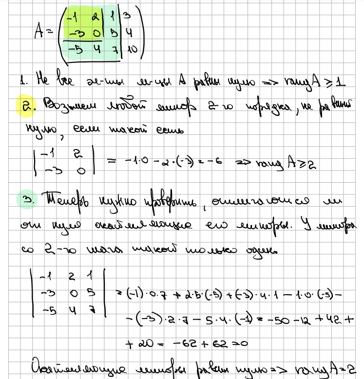

# Метод окаймляющих миноров

1. Находим ненулевой элемент матрицы, если такого нет, то ранг равен нулю.
2. Вычисляем [[6. Методы нахождения определителей#^581b6c|миноры]] 2-го порядка, которые содержат в себе выбранный элемент (окаймляют его).
3. Если все вычисленные миноры равны нулю, то ранг равен 1. Если среди них есть отличный от нуля, то вычисляются миноры 3-го порядка, окаймляющие его.
4. Продолжаем до тех пор, пока все миноры, окаймляющие ненулевой минор $k$-го порядка не будут равны нулю. В таком случае $rang \ A = k$.

>[!example] **Например**
>
# Метод элементарных преобразований

***Ранг матрицы при [[3. Элементарные преобразования|ЭП]] не меняется.***

Матрица $A$ называется ***ступенчатой***, если она имеет следующий вид:

$A = \left(\begin{array} \\ a_{11} & a_{12} & a_{13} & \dots & a_{1n} \\ 0 & a_{22} & a_{23} & \dots & a_{2n} \\ 0 & 0 & a_{33} & \dots & a_{3n} \\ \dots \\ 0 & 0 & 0 & a_{mn-1} & a_{mn} \\ \end{array}\right)$

С помощью ЭП нужно привести исходную матрицу $A$ к ступенчатому виду. Тогда ранг матрицы $A$ будет равен числу ее [[4. Линейная зависимость строк#^dbb324|линейно-независимых]] строк/столбцов, через которые линейно выражаются все остальные строки/столбцы.

>[!example] **Например**
>
>1. $\left( \begin{array} \\ 1 & 2 & 1 & 3 \\ 2 & 1 & 0 & -1 \\ 1 & -4 & -3 & -11 \end{array} \right)_{IIстр. - 2*Iстр., IIIстр. - Iстр.}$
>2. $\left( \begin{array} \\ 1 & 2 & 1 & 3 \\ 0 & -3 & -2 & -7 \\ 0 & -6 & -4 & -14 \end{array} \right)_{IIIстр. - 2*IIстр.}$
>3. $\left( \begin{array} \\ 1 & 2 & 1 & 3 \\ 0 & -3 & -2 & -7 \\ 0 & 0 & 0 & 0 \end{array} \right)$
>
>$rang \ A = 2$
# Свойства ранга

1. $rang \space A_{m*n} \leq min(m,n)$
2. $rang \space A = 0 \Leftrightarrow A = \mathbb{0}$
3. Для квадратной матрицы $rang \space A_{n*n} = n \Leftrightarrow \det A \neq 0$
