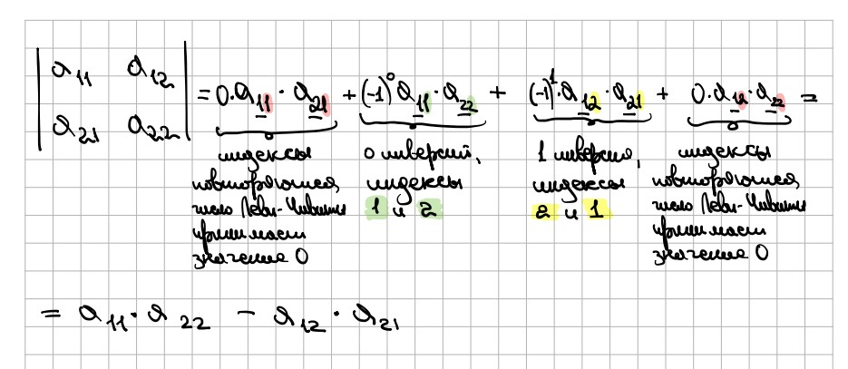

***Перестановкой*** заданного конечного множества $X = \{a_{1},a_{2},\dots,a_{n}\}$ называют произвольный упорядоченный набор всех элементов множества $X$ без повторений.
Группируя эти элементы в разном порядке, можно получить различные перестановки.
Всего из множества с $n$ элементами можно получить $n! = 1*2*3*\dots*n$ различных перестановок.

Обозначения перестановок:
$\pi$, $\alpha$

***Инверсия*** - пара в перестановке, в которых следующий элемент имеет меньшее значение, чем предыдущий:
$1 \leq i < j \leq n$ и $\pi(i) > \pi(j)$

>[!example] **Например**
>
>Есть набор элементов $\{1, 2, 3\}$, их перестановка $\pi = \{1, 3, 2\}$ имеет одну инверсию: $3$ и $2$.

***Символ Леви-Чивиты (эпсилон-тензор)*** - это многомерный объект (можно рассматривать как функцию), который принимает набор индексов и возвращает одно из 3 значений:
1) $\epsilon = 0$, когда есть хотя бы одна пара совпадающих индексов
2) $\epsilon = 1$, когда число инверсий четное (четность перестановок)
3) $\epsilon = -1$, когда число инверсий нечетное.

**Формула определителя в общем виде**:
$\left|\begin{array} \\ a_{11} & \dots & a_{1n} \\ \dots & \dots & \dots \\ a_{n1} & \dots & a_{nn} \\ \end{array}\right| = \underset{\alpha_{1},\alpha_{2},\dots,\alpha_{n}}{\Sigma} \space \epsilon_{i,j,\dots,k = \alpha} * a_{1i} * a_{2j} * \dots * a_{nk}$,
где $\alpha_{n}$ - перестановки индексов столбцов,
$\epsilon_{i,j,\dots,k} = \Bigl\{^{0, \space i=j \lor j=k \lor \dots}_{(-1)^{P(i,j,\dots,k)}}$ - символ Леви-Чивиты,
$a_{nk}$ - элементы матрицы.

>[!example] **Например**
>
